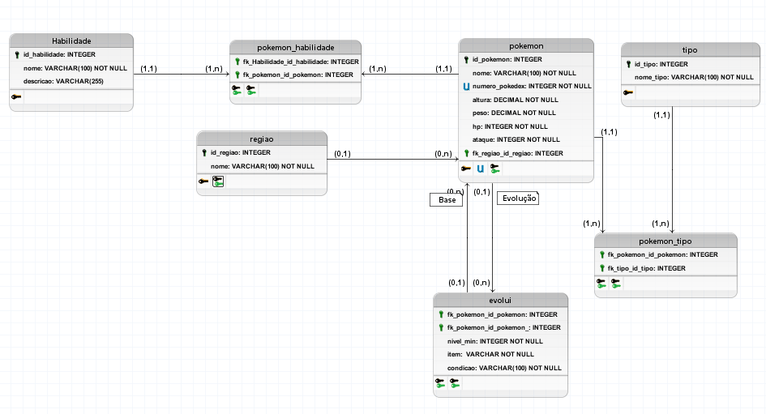

# DB Pokédex


Este repositório contém um **banco de dados relacional da Pokédex**, criado em MySQL.

## Estrutura do banco

- **tb_regiao**: Armazena as regiões dos Pokémon (ex: Kanto, Johto).  
- **tb_tipo**: Tipos de Pokémon (ex: Fogo, Água, Elétrico).  
- **tb_habilidade**: Habilidades especiais dos Pokémon (ex: Static, Blaze).  
- **tb_pokemon**: Informações básicas de cada Pokémon (nome, número, altura, peso, HP, ataque e região).  
- **tb_pokemon_tipo**: Relaciona Pokémon com tipos (N:N).  
- **tb_pokemon_habilidade**: Relaciona Pokémon com habilidades (N:N).  
- **tb_evolui**: Representa a evolução de Pokémon (nível, item ou condição necessária).  

## Modelo conceitual


Modelo Lógico


## Modelo Físico 
[Clique Aqui](db_pokedex.sql)


## View

- **vw_pokemon_completo**: Mostra cada Pokémon com sua região, tipos e habilidades em uma linha só.

```sql
SELECT * FROM vw_pokemon_completo;

